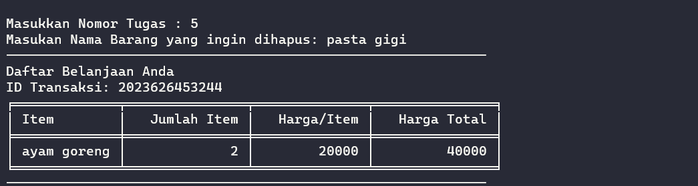

# Python Project: Super Cashier

- [Python Project: Super Cashier](#python-project-super-cashier)
  - [Background](#background)
  - [Obejective](#obejective)
    - [User Requirement](#user-requirement)
    - [Technical Requirment](#technical-requirment)
  - [Code Flow](#code-flow)
  - [Function Explanation](#function-explanation)
  - [Test Case](#test-case)
    - [Test 1 : **As a user I want to add item**](#test-1--as-a-user-i-want-to-add-item)
    - [Test 2 : **As a user I want to delete one of item**](#test-2--as-a-user-i-want-to-delete-one-of-item)
    - [Test 3 : **As a user I want to delete all transaction**](#test-3--as-a-user-i-want-to-delete-all-transaction)
    - [Test 4 : **As a user I want to know the total pricr of transaction**](#test-4--as-a-user-i-want-to-know-the-total-pricr-of-transaction)

## Background
Super cashier is a cashier self-service program that helps customers to shop. Thus improving the customer shopping experience even for customers who are out of town.


## Obejective
### User Requirement
- [x] As a user I want to create TransactionID 
- [x] As a user I want add item name, quantity and item price
- [x] As a user I want update item name, item qty and item price
- [x] As a user I want to delete one of item
- [x] As a user I want to delete all transaction
- [x] As a user I want to recheck the transaction
- [x] As a user I want to know the total pricr of transaction

### Technical Requirment
  - Modular Code
  - Clean Code (PEP8)
  - Defense Programming

## Code Flow
- main.py
    ```
    from menu import Transaction

    trx = Transaction()
    trx.display()
    ```
    In main.py import Transaction from menu module

- menu.py
    ```
    def display(self): 
    while self.choice != 9:
        self.list()
        self.action()

    print("""
        Thank you for using Super Cashier. See you next time ~
    ------------------------------------------------------
    """)
    ```
    The display method is used to display a list of action with an infinite loop. If the user chooses 9 (exit) then the infinite loop will finish and the transaction is complete.

    ```
    def action(self):
        self.choice = self.__choice_handler__()
        choice = self.choice
        if choice == 1:
            self.__add_item__()
        elif choice == 2:
            self.__update_item_name__()
        elif choice == 3:
            self.__update_item_qty__()
        elif choice == 4:
            self.__update_item_price__()
        elif choice == 5:
            self.__delete_item__()
        elif choice == 6:
            self.__reset_transaction__()
        elif choice == 7:
            self.__cart_list__()
        elif choice == 8:
            self.__checkout__()
            self.choice = 9
            return
        return 
    ```

## Function Explanation

| function                 | description                            |
| :----------------------- | :------------------------------------- |
| def `list`               | display user action text               |
| def `action`             | logic of user input action             |
| def `add_item`           | add item name, quantity and item price |
| def `update_item_name`   | update item name not case sensitive    |
| def `update_item_qty`    | update item qty based on item name     |
| def  `update_item_price` | update item price based on item name   |
| def `delete_item`        | delete one of item                     |
| def `reset_transaction`  | delete all of transaction cart         |
| def  `cart_list`         | recheck the transaction                |
| def `checkout`           | know the total price of transaction    |


## Test Case

### Test 1 : **As a user I want to add item**
First item


Second item


### Test 2 : **As a user I want to delete one of item**


### Test 3 : **As a user I want to delete all transaction**


### Test 4 : **As a user I want to know the total pricr of transaction**


__Author__
Copyright (c) _2023_ _Fadel Lukman H_